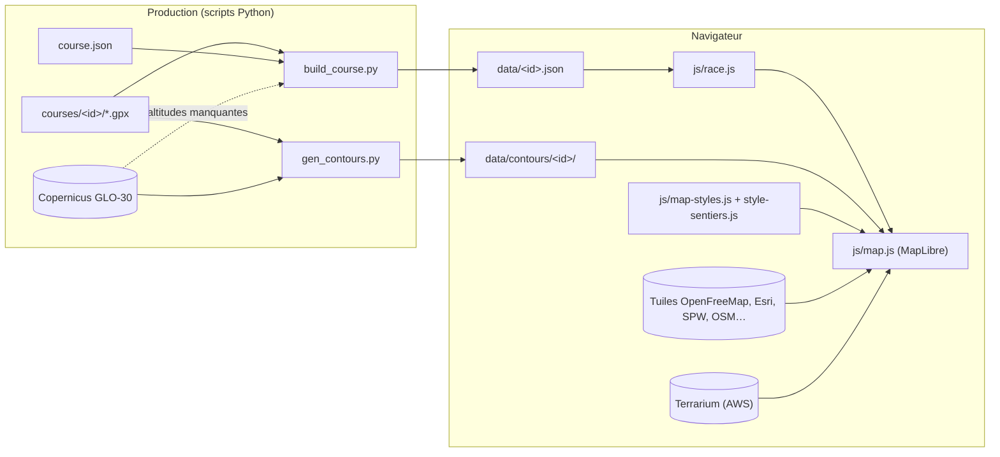
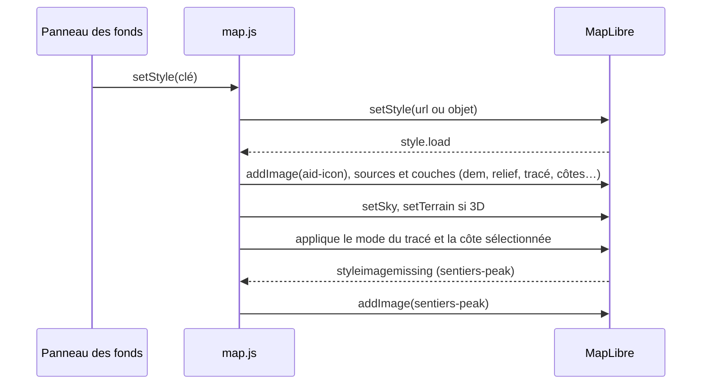

# Cartographie : documentation technique

Ce document décrit la partie cartographique de trace-view : technologies, sources de données, fonds de carte,
empilement des couches, cycle de vie de la carte et chaîne de production des données géographiques.
Pour l'usage général et l'ajout d'une course, voir le [README](../README.md).

## 1. Vue d'ensemble

L'application affiche **une seule carte MapLibre** qui sert à la fois la vue 2D (vue du dessus) et la vue 3D
(relief incliné). Le passage de l'une à l'autre active le terrain et incline la caméra ; aucune seconde carte
n'est créée.

La carte superpose trois familles de couches :

1. **Le fond de carte** (« style ») : tuiles vectorielles ou raster d'un fournisseur, interchangeable.
2. **Le relief** : ombrage (hillshade) et courbes de niveau, ajoutés par l'application sur le fond.
3. **Les couches de l'application** : tracé de la course, côtes, bornes kilométriques, flèches, ravitaillements,
   côte sélectionnée. Elles sont recréées à chaque changement de fond.

## 2. Pile technique

| Composant | Version | Rôle | Licence |
|---|---|---|---|
| [MapLibre GL JS](https://maplibre.org) | 5.24.0 (figée) | rendu WebGL de la carte, 2D et 3D, terrain, ciel | BSD-3 |
| [OpenFreeMap](https://openfreemap.org) | service | tuiles vectorielles (schéma OpenMapTiles), polices, sprites | données ODbL, attribution |
| [Terrarium](https://registry.opendata.aws/terrain-tiles/) (AWS Open Data, Mapzen) | service | modèle d'altitude en tuiles PNG : ombrage et terrain 3D | attribution |
| Copernicus DEM GLO-30 | service (COG sur S3) | courbes de niveau, altitudes des GPX qui n'en ont pas | libre, attribution |
| Esri World Imagery | service | photos satellites | conditions Esri |
| [Mapterhorn](https://mapterhorn.com) | service | relief haute résolution (qualité haute) | attribution, sources ouvertes |
| IGN Géoplateforme | service WMTS | orthophotos France (qualité haute) | Licence ouverte Etalab |
| SPW Géoportail Wallonie | service ArcGIS | orthophotos récentes en Wallonie | attribution SPW |
| OpenStreetMap, OpenTopoMap | service | fonds raster OSM et Topo | ODbL, CC-BY-SA |
| [Lucide](https://lucide.dev) | 1.51.0 (embarqué) | icônes (sommets, ravitaillements, interface) | ISC |
| rasterio, numpy (Python) | | lecture du DEM Copernicus (scripts uniquement) | BSD |

Le navigateur charge MapLibre depuis jsDelivr ; tout le reste de la carte est du JavaScript natif en modules ES,
sans étape de compilation.

## 3. Architecture du code

| Fichier | Responsabilité |
|---|---|
| `js/map.js` | création de la carte, sources et couches de l'application, panneau des fonds, 2D/3D, curseur, surbrillance, caméra |
| `js/map-styles.js` | catalogue des fonds de carte (`MAP_STYLES`), styles définis en JavaScript (OSM, Satellite, Topo, anciens styles) |
| `js/style-sentiers.js` | style « Sentiers » (fond par défaut) : palette, couches, icône des sommets |
| `styles/topo-trail.json` | ancien style « Topo trail » (déprécié) |
| `js/race.js` | chargement de `data/<id>.json`, coordonnées `[lng, lat, alt]`, pentes, icône des ravitaillements |
| `js/bus.js` | événements entre modules (la carte ne connaît ni le tableau ni le profil) |
| `js/config.js` | réglages de la carte (`MAP_CONFIG`), modifiables sans toucher au reste du code |

La carte réagit aux événements du bus :

| Événement | Effet sur la carte |
|---|---|
| `climb:select` | surbrillance de la côte, pastilles S/E, recadrage (2D) ou vol de caméra face à la pente (3D) |
| `trace:mode` | dégradé de pente sur le tracé, affichage des côtes colorées et de leurs pastilles |
| `cursor:move` / `cursor:stop` | marqueur du curseur du profil altimétrique |

Elle émet `climb:select-num` quand on clique sur la pastille d'une côte.

## 4. Sources de données

### Sources du fond de carte

| Source | Type | Fournisseur | Zooms | Utilisée par |
|---|---|---|---|---|
| `openmaptiles` | vector | `tiles.openfreemap.org/planet` (OpenMapTiles) | 0 à 14 (surzoom au-delà) | Sentiers, Streets, Light, Dark, anciens styles |
| `satellite` | raster 256 | Esri World Imagery | 0 à 19 | Satellite |
| `spw-ortho` | raster 256 | SPW, export ArcGIS reprojeté en EPSG:3857, image 512 px | 10 à 19, limité à la Wallonie (`bounds`) | Satellite (par-dessus Esri) |
| `osm` | raster 256 | `tile.openstreetmap.org` | 0 à 19 | OSM |
| `topo` | raster 256 | `tile.opentopomap.org` | 0 à 17 | Topo (courbes) |

Polices : `tiles.openfreemap.org/fonts/{fontstack}/{range}.pbf` pour **tous** les fonds, afin que les libellés
de l'application (Noto Sans) s'affichent partout.

### Sources ajoutées par l'application

| Source | Type | Contenu | Origine |
|---|---|---|---|
| `dem` | raster-dem (terrarium) | altitudes : ombrage + terrain 3D | qualité standard : Terrarium AWS (256 px, zoom 14) ; qualité haute : Mapterhorn (512 px, zoom 17) |
| `ign-ortho` | raster 256 | orthophotos IGN, sous les orthophotos SPW | qualité haute + fond Satellite, France (`data.geopf.fr`) |
| `contours-thick` | geojson | courbes maîtresses (50 m) | `data/contours/<id>/thick.geojson` |
| `contours-thin` | geojson | courbes intermédiaires (10 m) | `data/contours/<id>/thin.geojson`, chargées à partir de `thinContoursLoadZoom` (12,5) |
| `trace` | geojson, `lineMetrics: true` | tracé complet (LineString, 3 coordonnées) | `data/<id>.json` |
| `climbs` | geojson | segments des côtes colorées (hors < 4 %) | idem |
| `climb-hl` | geojson | côte sélectionnée | idem, mise à jour à la sélection |
| `arrows` | geojson | flèches de direction, une par km, avec un niveau de densité (`tier`) | calculé dans `map.js` |
| `km` | geojson | bornes tous les 5 km (`major` tous les 10 km) | calculé |
| `badges` | geojson | pastilles numérotées au sommet des côtes | calculé |
| `aid` | geojson | ravitaillements (`idx` vers `race.aidStations`) | `data/<id>.json` |

## 5. Fonds de carte

| Clé | Libellé | Statut | Définition | Exagération 3D | Courbes |
|---|---|---|---|---|---|
| `sentiers` | Sentiers | **par défaut** | `js/style-sentiers.js` | 1,5 | oui |
| `osm` | OSM | actif | raster OSM | 1,3 | non |
| `satellite` | Satellite | actif | Esri + SPW | 1,5 | non |
| `bright` | Streets | actif | style OpenFreeMap | 1,0 | non |
| `positron` | Light | actif | style OpenFreeMap | 0,8 | non |
| `dark` | Dark | actif | style OpenFreeMap | 0,8 | non |
| `topo` | Topo (courbes) | actif | raster OpenTopoMap | 1,4 | non |
| `topotrail` | Topo trail | **déprécié** | `styles/topo-trail.json` | 1,5 | oui |
| `terrain` | Terrain | **déprécié** | `js/map-styles.js` | 1,5 | oui |

Les styles marqués `dark` inversent les contours du tracé (blanc au lieu de noir), les halos des libellés et les
couleurs du ciel. Les styles dépréciés reprennent la palette et les réglages du style LiveTrail : ils sont rangés
dans la ligne « Anciens » du panneau et seront supprimés.

## 6. Empilement des couches

Ordre de rendu, du bas vers le haut. Les couches de relief sont insérées **sous le premier libellé** du fond
(`firstLabelId()`), pour que les noms de lieux restent lisibles ; les couches de l'application sont ajoutées
au-dessus de tout le fond.

| # | Couche (id) | Type | Zoom | Rôle |
|---|---|---|---|---|
| 1 | *couches du fond* (remplissages, eau, routes…) | divers | | fond de carte choisi |
| 2 | `terrain-hillshade` | hillshade | | ombrage du relief (`hillshadeIntensity`, `hillshadeLightDirection` : 0,4, nord-ouest) |
| 3 | `contours-thin` | line | ≥ 13 | courbes intermédiaires (si le fond a `contours`) |
| 4 | `contours-thick` | line | ≥ 11 | courbes maîtresses |
| 5 | `contours-labels` | symbol | ≥ 14 | altitude le long des courbes maîtresses |
| 6 | *libellés du fond* | symbol | | noms de lieux, routes, sommets (sommets à partir de `peaksMinZoom`, voir section 12) |
| 7 | `trace-glow` | line | | halo flou du tracé (noir, ou blanc sur fond sombre) |
| 8 | `trace-outline` | line | | contour net du tracé |
| 9 | `trace-line` | line | | trait du tracé : couleur de la course, ou `line-gradient` par pente en mode Pente |
| 10 | `climbs-line` | line | | côtes colorées par catégorie (mode Côtes) |
| 11 | `climb-hl-outline` | line | | contour blanc de la côte sélectionnée |
| 12 | `climb-hl-line` | line | | côte sélectionnée |
| 13 | `trace-arrows` | symbol | ≥ 9 | flèches de direction : tous les 10, 5, 2 puis 1 km selon le zoom |
| 14 | `km-circle`, `km-text` | circle, symbol | dizaines toujours, cinq ≥ 13 | bornes kilométriques |
| 15 | `badges-circle`, `badges-text` | circle, symbol | | n° des côtes au sommet (mode Côtes) ; survol : D+ et pente |
| 16 | `aid-circle`, `aid-icon`, `aid-label` | circle, symbol | | ravitaillements : cercle blanc, icône de la course, nom et km |
| 17 | *marqueurs DOM* | `maplibregl.Marker` | | départ / arrivée (une pastille si boucle), S/E de la côte, curseur du profil |

Les marqueurs DOM ne font pas partie du style : ils survivent aux changements de fond et suivent le relief en 3D.

### Ressources graphiques

| Image | Ajoutée | Source |
|---|---|---|
| `aid-icon` | à chaque `style.load` (pixelRatio 4) | icône de l'identité de la course (`branding/*.json`) ou couteau/fourchette par défaut |
| `sentiers-peak` | sur `styleimagemissing` (pixelRatio 2) | icône montagne Lucide |

## 7. Le style « Sentiers »

Défini dans `js/style-sentiers.js`, sur la source `openmaptiles`. Objectif : faire ressortir ce qui compte en
trail (sentiers, chemins, revêtement), effacer le reste, rester lisible sous le tracé rouge et sur l'ombrage.

### Palette

| Rôle | Couleur | | Rôle | Couleur |
|---|---|---|---|---|
| Fond (papier) | `#f4f1e8` | | Eau | `#9dcbe1` |
| Cultures | `#ebe5cc` | | Rivières | `#7ab5d3` |
| Prairies | `#d9e6bd` | | Sentier en terre | `#b4522a` |
| Broussailles | `#cddcaa` | | Chemin | `#8b6b45` |
| Forêts | `#aed096` | | Route non revêtue (bordure) | `#9a7a52` |
| Zones habitées | `#e8e0d2` | | Voie piétonne revêtue | `#a99d8d` |
| Bâtiments | `#d4c9b8` | | Textes (lieux) | `#3a2f22` |

Routes, de la plus importante à la moins importante : `#e9a865`, `#efbb80`, `#f5d08f`, `#f8e3ad`, `#fbf0d4`,
`#ffffff`, bordures `#9b7d55` (grands axes) et `#a8977b`.

### Couches

| Groupe | Couches | Filtre principal (attributs OpenMapTiles) |
|---|---|---|
| Fond | `background` | |
| Occupation du sol | `sentiers-farmland`, `-meadow`, `-scrub`, `-wetland`, `-forest`, `-rock`, `-ice`, `-urban` | `landcover.class`, `landuse.class` ; remplissages translucides (0,55 à 0,85) pour laisser voir l'ombrage |
| Eau | `sentiers-water`, `-river`, `-stream` | `water`, `waterway.class` |
| Limites | `sentiers-border` | `boundary.admin_level ≤ 4`, hors frontières maritimes |
| Chemins | `sentiers-paved-path`, `-track`, `-trail`, `-steps` | `transportation.class` (`path`, `track`), `subclass`, `surface` |
| Routes | `sentiers-<classe>-casing`, `sentiers-<classe>`, `sentiers-minor-unpaved` | `transportation.class`, hors tunnels |
| Bâti | `sentiers-building` | `building`, zoom ≥ 14 |
| Libellés | `sentiers-road-label`, `-water-label`, `-waterway-label`, `-peak`, `-village`, `-town`, `-city` | `name:fr` sinon `name` |

Rendu des voies selon le revêtement (`surface`) et le type (`subclass`) :

| Voie | Condition | Rendu |
|---|---|---|
| Sentier en terre | `class=path`, `surface≠paved`, hors escaliers, places, pistes cyclables | tirets courts rouge-brun, zoom ≥ 12 |
| Chemin | `class=track`, `surface≠paved` | tirets longs bruns, zoom ≥ 11 |
| Petite route non revêtue | `class=minor/service`, `surface=unpaved` | route blanche + bordure en tirets couleur terre, zoom ≥ 13 |
| Voie piétonne revêtue | `class=path`, `surface=paved` | trait gris fin, zoom ≥ 14 |
| Escaliers | `subclass=steps` | marches, zoom ≥ 15 |

Épaisseurs des routes : une seule échelle exponentielle (`zoom` 9, 13, 17 → 0,5, 1,4, 4) multipliée par le rang
de la voie (1 pour une petite route, 2,6 pour une autoroute).

### Qualité d'affichage (par course)

`"quality": "high"` dans `course.json` (proposé par le skill `add-course`) :

| | Standard | Haute |
|---|---|---|
| Relief (`dem`) | Terrarium AWS, zoom 14 | Mapterhorn, zoom 17 : crêtes, ravins et pentes rocheuses nets |
| Satellite | Esri + SPW (Wallonie) | Esri + IGN (France) + SPW (Wallonie) |
| Poids | léger | tuiles de relief ≈ 150 Ko en montagne |

Hors de France, les tuiles IGN répondent « introuvable » : avertissement silencieux, Esri reste visible.

## 8. 2D et 3D

| | 2D | 3D |
|---|---|---|
| Terrain | aucun (`setTerrain(null)`) | `setTerrain({ source: 'dem', exaggeration })` : `terrainExaggeration` de la course (`course.json`, ×2,5 pour les courses ardennaises) sinon celle du fond |
| Caméra | inclinaison 0, nord en haut | `pitch3D` (55°) en vue d'ensemble, `climbFlightPitch` (60°) face à la pente sur une côte |
| Rotation, inclinaison au doigt | désactivées | activées |
| Ciel | sans effet | `setSky` : bleu clair et brume couleur papier (ou version sombre) |

L'ombrage du relief est visible dans les deux vues : il utilise la même source `dem` que le terrain.

**Transition 2D ↔ 3D** (réglage `mode3DTransition`) :

- `'fade'` (défaut) : **fondu enchaîné**. Une image figée de la carte (copiée du canvas WebGL vers un canvas 2D
  pendant l'évènement `render`) recouvre la carte ; dessous, la bascule est instantanée (terrain à pleine exagération, `jumpTo`) ;
  quand la nouvelle vue est dessinée (`idle`, au plus `fadeMaxWait`), l'image s'efface en `fadeDuration` ms
  (transition CSS). Fluide sur toute machine : aucune image intermédiaire 3D à calculer. Pendant l'attente,
  l'image est voilée et floutée, une pastille « Passage en 3D… » / « Retour en 2D… » apparaît après
  `fadeLabelDelay`, et le bouton 2D/3D est grisé (indicateur tournant, pas de double clic).
- `'animate'` : la caméra s'incline et le relief monte, décrit ci-dessous.

En mode animé, le relief n'apparaît pas d'un coup. Le terrain est créé à exagération 0, puis sa valeur
monte jusqu'à l'exagération cible pendant que la caméra s'incline (même durée, même courbe d'accélération) ; au
retour en 2D, elle redescend à 0 avant la suppression du terrain. Pendant l'animation, seule la propriété
`exaggeration` du terrain existant change à chaque image : `setTerrain` recrée le terrain et sa texture de
rendu, trop coûteux image par image ; il n'est rappelé qu'en fin d'animation.

Vol vers une côte en 3D : cap calculé du début au sommet de la côte (`bearingBetween`), cadrage par
`cameraForBounds` avec ce cap, puis `flyTo` à `climbFlightPitch` (60°) d'inclinaison.

## 9. Cycle de vie et changement de fond

- `setStyle` remplace tout le style : les sources et couches de l'application sont recréées par `addOverlays()`
  sur chaque `style.load`. L'état (mode du tracé, côte sélectionnée, 2D/3D) vit dans `map.js` et est réappliqué.
- Les courbes de niveau déjà téléchargées sont gardées en mémoire (`contourCache`) et réinjectées sans réseau.
- Une tuile tierce qui échoue (réseau, serveur SPW lent) produit un avertissement, pas une erreur.

## 10. Performances

| Mesure | Effet |
|---|---|
| Courbes fines chargées seulement au zoom ≥ `thinContoursLoadZoom` (12,5) | ~1 à 2 Mo évités tant qu'on ne zoome pas |
| Coordonnées des courbes arrondies à 5 décimales (≈ 1 m) | fichiers divisés par 2 environ ; zone limitée au parcours + 2 km |
| Courbes maîtresses absentes du fichier des courbes fines | pas de double dessin |
| Dégradé de pente en `step` sur `line-progress`, un arrêt par changement de couleur | ~230 arrêts au lieu d'un par point |
| `DEM` en `tileSize: 256` (taille réelle des tuiles Terrarium) | relief à la bonne résolution (512 chargeait un zoom trop bas) |
| Orthophotos SPW demandées en 512 px pour des tuiles 256 | net sur écran Retina |
| Libellés et pastilles en couches `symbol`/`circle` (GPU) plutôt qu'en marqueurs DOM | fluide malgré des centaines d'éléments |

## 11. Production des données géographiques

| Étape | Script | Entrée | Sortie |
|---|---|---|---|
| Tracé, côtes, statistiques, ravitaillements | `scripts/build_course.py` | GPX + `course.json` | `data/<id>.json`, `data/courses.json` |
| Altitudes manquantes (sur demande) | `build_course.py --fill-elevation` | GPX sans `<ele>` | tracé densifié à 20 m, cache `elevation-cache.json` |
| Courbes de niveau | `scripts/gen_contours.py` | GPX (emprise) + Copernicus GLO-30 | `data/contours/<id>/{thin,thick}.geojson` |

`gen_contours.py` : emprise du parcours + 2 km, tuiles Copernicus 1° × 1° déduites (fusion si plusieurs),
marching squares tous les 10 m, chaînage des segments, lissage de Chaikin, simplification Douglas-Peucker
(≈ 5 m), arrondi à 5 décimales.

Format des coordonnées dans l'application : `race.lngLat` = `[longitude, latitude, altitude]` (ordre GeoJSON),
alors que `data/<id>.json` stocke `track.points` en `[latitude, longitude]` (ordre du GPX).

## 12. Réglages (`js/config.js`)

`MAP_CONFIG` regroupe les paramètres de la carte modifiables sans toucher au reste du code (modifier la valeur
puis recharger la page). Les zooms propres à un fond (apparition des routes, bâtiments, sentiers) restent dans
le style lui-même (`js/style-sentiers.js`) ; l'exagération du relief en 3D reste propre à chaque fond (`exag`
dans `MAP_STYLES`).

| Réglage | Défaut | Effet |
|---|---|---|
| `defaultStyle` | `'sentiers'` | fond de carte au chargement (clé de `MAP_STYLES`) ; repli sur le premier fond si la clé n'existe pas |
| `stylePanelCollapsed` | `true` | panneau « Fond de carte » replié au démarrage |
| `peaksMinZoom` | 15 | sommets (icône, nom, altitude) : appliqué à chaque `style.load` à toutes les couches `mountain_peak` (`setLayerZoomRange`) ; Streets, Light et Dark n'en affichent pas, les fonds raster ne sont pas concernés |
| `contoursMinZoom.thick` / `.thin` / `.labels` | 11 / 13 / 14 | apparition des courbes maîtresses, intermédiaires et des altitudes ; fondu sur 2 et 1,5 niveaux de zoom |
| `thinContoursLoadZoom` | 12,5 | téléchargement des courbes intermédiaires (≈ 1 à 2 Mo) pas avant ce zoom |
| `kmMarkersEvery5Zoom` | 13 | bornes tous les 5 km (les dizaines toujours visibles) |
| `arrowsZooms` | `[9, 10.5, 12, 13.5]` | flèches de direction tous les 10, 5, 2 puis 1 km |
| `hillshadeIntensity` | 0,4 | force de l'ombrage du relief (0 à 1) |
| `hillshadeLightDirection` | 315 | direction de la lumière en degrés (nord-ouest) |
| `satelliteHillshade` | `false` | ombrage du relief sur le fond Satellite (les photos ont déjà leurs ombres ; l'ombrage les délave, surtout en montagne) |
| `fog` / `satelliteFog` | `true` / `false` | brume vers l'horizon en 3D, sur les fonds de carte / sur Satellite |
| `pitch3D` / `bearing3D` | 55 / -15 | inclinaison et orientation à l'activation de la 3D |
| `climbFlightPitch` | 60 | inclinaison du vol vers une côte en 3D |
| `climbMaxZoom.map2D` / `.map3D` | 15 / 15,5 | zoom maximal en cadrant une côte |
| `mode3DTransition` | `'fade'` | passage 2D ↔ 3D : fondu enchaîné (`'fade'`) ou caméra animée (`'animate'`) |
| `fadeDuration` / `fadeMaxWait` | 450 / 2500 ms | durée du fondu ; attente maximale du rendu 3D avant le fondu |
| `fadeLabelDelay` | 300 ms | délai avant la pastille « Passage en 3D… » (bascule rapide : pas de pastille) |
| `fadeSnapshotWait` | 400 ms | attente maximale de l'image figée ; au-delà, bascule directe sans fondu |
| `animationDuration` | 900 / 1800 / 1200 / 800 ms | recadrage 2D, vol 3D, passage en 3D, retour en 2D |

Le test de fumée vérifie que ces réglages sont effectivement appliqués (fond, panneau, courbes, ombrage, bornes,
inclinaison en 3D).

## 13. Étendre la carte

**Ajouter un fond de carte** : ajouter une entrée à `MAP_STYLES` (`js/map-styles.js`) avec `url` (URL d'un
style ou objet de style), `label` et `exag` ; `contours: true` pour superposer les courbes, `dark: true` pour un
fond sombre. Le style doit utiliser les polices OpenFreeMap. Ajouter la vignette `.m3d-thumb-<clé>` dans
`style.css`.

**Ajouter une couche de l'application** : créer sa source et sa couche dans `addOverlays()` (`js/map.js`), à la
bonne place dans l'ordre du tableau de la section 6. Elle sera automatiquement recréée à chaque changement de fond.
Pour une couche qui doit rester sous les libellés du fond, passer `firstLabelId()` en second argument de `addLayer`.

**Modifier le style Sentiers** : les couleurs sont regroupées dans l'objet `C` en tête de `js/style-sentiers.js`.

## 14. Tests

`npm run test:smoke` vérifie notamment : chargement de la carte, modes du tracé (dégradé, côtes), curseur,
surbrillance et pastilles, passage en 3D (terrain, inclinaison), changement successif de tous les fonds sans
perte (surbrillance, icône, relief), zoom d'apparition des sommets, retour en 2D, absence d'erreur JavaScript.

## 15. Limites connues

- **Styles dépréciés** : Topo trail et Terrain reprennent le style LiveTrail ; à supprimer (deux entrées de
  `MAP_STYLES`, `styles/topo-trail.json`, le bloc Terrain).
- **Orthophotos SPW** : images générées à la demande par le serveur du SPW, plus lentes qu'un cache de tuiles,
  non adaptées à un fort trafic.
- **Copernicus GLO-30** : modèle de surface (30 m) ; sous la forêt, il mesure le haut des arbres. Suffisant pour
  les courbes de niveau, moins précis qu'un GPX d'origine pour les altitudes.
- **Services tiers sans clé** (OpenFreeMap, Terrarium, OSM, OpenTopoMap) : soumis à leurs conditions d'usage
  équitable ; pour un trafic important, prévoir un hébergement des tuiles.
